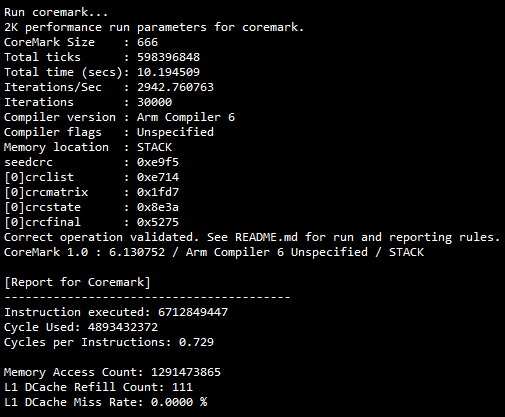
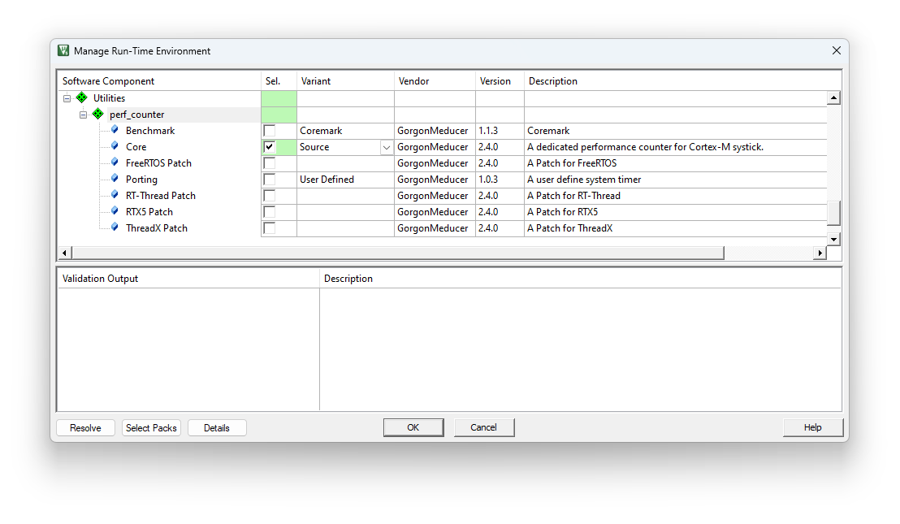
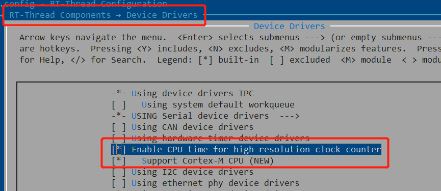

[](https://deepwiki.com/GorgonMeducer/perf_counter)  

# perf_counter (v2.5.4)
A dedicated performance counter mainly for micro-controllers. 

For Cortex-M processors, the Systick will be used by default. The `perf_counter` shares the SysTick with users' original SysTick function(s) without interfering with it. This library will bring new functionalities, such as performance counter,` perfc_delay_us`, `perfc_delay_ms` and `clock()` service defined in `time.h`.

A dedicated template is provided to port the perf_counter to different architectures or using a different Timer instead of SysTick in Cortex-M processors.

### Features:

- **Measure CPU cycles for specified code segment**
- **Add Coremark 1.0**
- **Provide Timer Service for EventRecorder automatically.**
- **Enhanced measurement services for RTOS**
  - Measures **RAW / True** cycles used for specified code segment inside a thread, **i.e. scheduling cost are removed**. 
  - Measure **RAW/True** cycles used for a data-process-path across multiple threads.
- **Easy to use**
  - Helper macros: `__cycleof__()` , `__super_loop_monitor__()` , `__cpu_usage__()`, `__cpu_perf__() `etc.
  - Helper functions: `start_cycle_counter()`, `stop_cycle_counter()` etc.
- Enable a broader processor architecture support
  - **Support ALL Cortex-M processors**
    - SysTick
    - Performance Monitor Unit (PMU)

  - Easy to port to a different architecture with a porting template
- **Provide Free Services**
  - Would **NOT** interfere with existing SysTick-based applications
- **Support most of the arm compilers**
  - Arm Compiler 5 (armcc), Arm Compiler 6 (armclang)
  - arm gcc
  - LLVM
  - IAR
- **Simplified Deployment**
  - **Drag-and-Drop deployment for Arm Compiler 5 and Arm Compiler 6.**
  - **CMSIS-Pack is available**
  - **RT-Thread package is avaialble**
- **Time-based services**
  - `perfc_delay_us()` and `perfc_delay_ms()` with **64bit return value**.
    - Adds weak entries `perfc_delay_us_user_code_in_loop()` and `perfc_delay_ms_user_code_in_loop()` for users to override, e.g. feeding the watchdog. 
  - Provides Timestamp services via `get_system_ticks()`, `get_system_us` and `get_system_ms()`.
  - When passing `false` to `perfc_init()`, it is possible to use perf_counter in ISRs or global interrupt handling is disabled.
  - Users can call micro-seconds related APIs even when the system timer clock is less than 1MHz. 
- **Support both RTOS and bare-metal environments**
  - Supports SysTick Reconfiguration
  - Supports changing System Frequency
  - Supports stack-overflow detection in RTOS environment via `perfc_check_task_stack_canary_safe()`
  - Adds macro `__PERFC_SAFE ` to avoid blocking high priority ISRs and tasks. Users should define the system timer priority level with macro `__PERFC_SYSTIMER_PRIORITY__ `. In Cortex-M, `0` means the highest configurable exception level.
- **Utilities for C language enhancement**
  - Macros to detect compilers, e.g. `__IS_COMPILER_ARM_COMPILER_6__`, `__IS_COMPILER_LLVM__` etc.
  - Macros to detect compiler features: 
    - `__COMPILER_HAS_GNU_EXTENSIONS__`
    - `__IS_COMPILER_SUPPORT_C99__`
    - `__IS_COMPILER_SUPPORT_C11__`
  - Macro to create atomicity for a specified code block, i.e. `__IRQ_SAFE{...}`.
  - Helper macros for C language extension:
    - VB like `with()`
    - `foreach()`, `dimof()`  and `CONNECT()`
    - C# like `using()`
    - simple overload feature of OOPC made out of ANSI-C99, `__PLOOC_VA_NUM_ARGS()`.
    - ...
  - A dedicated macro `__perfc_sync_barrier__()` for code barrier. 
  - Macros to measure stack usage
    - Adds a macro `__stack_usage__()` and `__stack_usage_max__()` to measure the stack usage for a given code segment.
    - Adds a macro `ISR()` to measure the stack usage of a given Cortex-M Exception handling. 
      - You can define macro `__PERFC_STACK_CHECK_IN_ISR__` in project configuration to enable this feature.
    - You can define macro `__PERFC_STACK_WATERMARK_U32__`  in your project configuration to override the default watermark, i.e. `0xDEADBEEF`.
    - Supports for architectures that use growing-upward stacks. You can define macro `__PERFC_STACK_GROWS_UPWARD__` to switch.
- Adds C Language Extensions
  - Adds Coroutine support
    - Adds watermark to stack and users can call `perfc_coroutine_stack_remain()` to get the stack usage info.
    - Defining macro `__PERFC_COROUTINE_NO_STACK_CHECK__` in **compilation command line** disables the stack-checking feature. 
  - Adds protoThread support with/without the coroutine.
    -  Adds timeout feature in **wait_xxxx**


### Important Updates

- Following functions/macros are **deprecated**, please use the version with `perfc_` as prefix:
  - `init_cycle_counter()` -> `perfc_init()`
  - `delay_us()` -> `perfc_delay_us()`
  - `delay_ms()` -> `perfc_delay_ms()`
  - `CONNECT()` -> `PERFC_CONNECT()`
  - `using()` -> `perfc_using()`
  - `with()` -> `perfc_with()`
  - `foreach()` -> `perfc_foreach()`

- You can define the macro `__PERFC_NO_DEPRECATED__` to disable the alias of the deprecated APIs.

  


## 1. How To Use

### 1.1 Measure CPU cycles for a specified code segment

You can measure a specified code segment with a macro helper `__cycleof__()`, a wrapper of `get_system_ticks()`.

**Syntax:**

```c
__cycleof__(<Description String for the target>, [User Code, see ref 1]) {
    //! target code segment of measurement
    ...
}
```

Here, [**ref 1**] is a small user code to read the measurement result via a local variable `__cycle_count__`. This User Code is optional. If you don't put anything here, the measured result will be shown with a `__perf_counter_printf__`. 

> [!NOTE]
>
> The first parameter cannot be ignored. If you don't want to give a description string, please pass an empty string i.e. "". 

#### **Example 1:** Simple measurement with `printf()`

```c
    __cycleof__("") {
        foreach(example_lv0_t, s_tItem, ptItem) {
            __perf_counter_printf__("Processing item with ID = %d\r\n", _->chID);
        }
    }
```

You will see the measured result in the console:

 


#### **Example 2:** Read measured result via `__cycle_counter__`

```c
    int64_t lCycleResult = 0;

    /* measure cycles and store it in a dedicated variable without printf */
    __cycleof__("delay_us(1000ul)", 
        /* insert code to __cycleof__ body, "{}" can be omitted  */
        {
            lCycleResult = __cycle_count__;   /*< "__cycle_count__" stores the result */
        }) {
        perfc_delay_us(1000ul);
    }

    __perf_counter_printf__("\r\n delay_us(1000ul) takes %lld cycles\r\n", lCycleResult);
```

The result is read out from `__cycle_count__`and used in other place:

 

### 1.2 Performance Analysis

#### 1.2.1 CPU Usage

For both bare-metal and OS environments, you can measure the CPU Usage with macro `__cpu_usage__()` for a given code segment as long as it is executed repeatedly. 

**Syntax**

```c
__cpu_usage__(<Iteration Count before getting an average result>, [User Code, see ref 1]) {
    //! target code segment of measurement
    ...
}
```

Here, [**ref 1**] is a small user code to read the measurement result via a local variable `__usage__`. This User Code is optional. If you don't put anything here, the measured result will be shown with a `__perf_counter_printf__`. 

##### **Example 1: the following code will show 30% of CPU Usage:**

```c
void main(void)
{
    ...
    while (1) {
        __cpu_usage__(10) {
            perfc_delay_us(30000);
        }
        perfc_delay_us(70000);
    }
    ...
}
```

##### Example 2: Read measurement result via `__usage__`

```c
void main(void)
{
    ...
    while (1) {
        
        __cpu_usage__(10, {
            float fUsage = __usage__; /*< "__usage__" stores the result */
            __perf_counter_printf__("task 1 cpu usage %3.2f %%\r\n", (double)fUsage);
        }) {
            perfc_delay_us(30000);
        }
        

        perfc_delay_us(70000);
    }
    ...
}
```

> [!NOTE]
>
> The `__usage__` stores the percentage information.


#### 1.2.2 Cycle per Instruction and L1 DCache Miss Rate

For **Armv8.1-m** processors that implement the **PMU**, it is easy to measure the **CPI** (Cycle per Instruction) and **L1 DCache miss rate** with the macro `__cpu_perf__()`.

**Syntax**:

```c
__cpu_perf__(<Description String for the target>, [User Code, see ref 1]) {
    //! target code segment of measurement
    ...
}
```

Here, [**ref 1**] is a small user code to read the measurement result via a local **struct** variable `__PERF_INFO__`. This User Code is optional. If you don't put anything here, the measured result will be shown with a `__perf_counter_printf__`. The prototype of the `__PERF_INFO__` is shown below:

```c
struct {                                                                
    uint64_t dwNoInstr;                 /* number of instruction executed */        
    uint64_t dwNoMemAccess;             /* number of memory access */
    uint64_t dwNoL1DCacheRefill;        /* number of L1 DCache Refill */
    int64_t lCycles;                    /* number of CPU cycles */
    uint32_t wInstrCalib;                                               
    uint32_t wMemAccessCalib;                                           
    float fCPI;                         /* Cycle per Instruction */
    float fDCacheMissRate;              /* L1 DCache miss rate in percentage */
} __PERF_INFO__;
```

For example, when inserting user code, you can read CPI from `__PERF_INFO__.fCPI`.

**Example 1: measure the Coremark**

```c
void main(void)
{
    perfc_init(false);

    __perf_counter_printf__("Run coremark\r\n");

#ifdef __PERF_COUNTER_COREMARK__
    __cpu_perf__("Coremark") {
        coremark_main();
    }
#endif

    while(1) {
        __NOP();
    }
}
```

The result might look like the following:

 


### 1.3 Timestamp

You can get the system timestamp (since the initialization of perf_counter service) via the functions `get_system_ticks()` and `get_system_ms()`. 

> [!NOTE]
>
>  The `get_system_ms()` is **NOT** a wrapper of the function `get_system_ticks()`. 


There are various ways to take advantage of those functions. 

#### Example 3: Use `get_system_ms()` as random seed

```c
#include <stdio.h>
#include <stdlib.h>
#include "perf_counter.h"

int main (void) 
{
   int i, n;
   
   ...
       
   n = 5;
   
   /* Initialize random number generator */
   srand((unsigned) get_system_ticks());

   /* Print 5 random numbers from 0 to 1024 */
   for( i = 0 ; i < n ; i++ ) {
      __perf_counter_printf__("%d\n", rand() & 0x3FF);
   }
   
   return(0);
}
```


#### Example 4: Measure CPU cycles

```c
    do {
        int64_t tStart = get_system_ticks();
        __IRQ_SAFE {
            __perf_counter_printf__("no interrupt \r\n");
        }
        __perf_counter_printf__("used clock cycle: %d", (int32_t)(get_system_ticks() - tStart));
    } while(0);
```

This example shows how to use the delta value of `get_system_ticks()` to measure the CPU cycles used by a specified code segment. In fact, the `__cycleof__()` is implemented in the same way:

```c
#define __cycleof__(__STR, ...)                                                 \
            perfc_using(int64_t _ = get_system_ticks(), __cycle_count__ = _,    \
                {__perfc_sync_barrier__();},                                    \
                {                                                               \
                __perfc_sync_barrier__();                                       \
                _ = get_system_ticks() - _ - g_nOffset;                         \
                __cycle_count__ = _;                                            \
                if (__PLOOC_VA_NUM_ARGS(__VA_ARGS__) == 0) {                    \
                    __perf_counter_printf__("\r\n");                            \
                    __perf_counter_printf__("-[Cycle Report]");                 \
                    __perf_counter_printf__(                                    \
                        "------------------------------------\r\n");            \
                    __perf_counter_printf__(                                    \
                        __STR " total cycle count: %ld [%08lx]\r\n",            \
                            (long)_, (long)_);                                  \
                } else {                                                        \
                    __VA_ARGS__                                                 \
                };                                                              \
            })
```


### 1.4 Timer Services

perf_counter provides the basic timer services for delaying a given period and polling-for-timeout. For example:

```c
perfc_delay_ms(1000);   /* block the program for 1000ms */
perfc_delay_us(50);	  /* block the program for 50us */

while(1) {
    /* return true every 1000 ms */
    if (perfc_is_time_out_ms(1000)) {
        /* print hello world every 1000 ms */
        __perf_counter_printf__("\r\nHello world\r\n");
    }
}
```


### 1.5 Work with EventRecorder in MDK

If you are using EventRecorder in MDK, once you deploy the `perf_counter`, it will provide the timer service for EventRecorder by implementing the following functions: `EventRecorderTimerSetup()`, `EventRecorderTimerGetFreq()` and `EventRecorderTimerGetCount()`. 

If you have not modified anything in `EventRecorderConf.h`, **you don't have to**, and please keep the default configuration.  If you see warnings like this:

```
Invalid Time Stamp Source selected in EventRecorderConf.h!
```

Please set the macro `EVENT_TIMESTAMP_SOURCE` to `3` to suppress it.

> [!IMPORTANT]
>
> Please always make sure the macro `EVENT_TIMESTAMP_FREQ` is `0`


**By using perf_counter as the reference clock, EventRecorder can have the highest clock resolution on the target system without worrying about the presence of DWT or any conflicting usage of SysTick.** 


### 1.6 On System Environment Changing

#### 1.6.1 System Frequency Changing

If you want to change the System Frequency, **after** the change, make sure:

1. The `SystemCoreClock` has been updated with the new system frequency. Usually, the HAL will update the `SystemCoreClock` automatically, but in some rare cases where `SystemCoreClock` is updated accordingly, you should do it yourself.

2. please call `update_perf_counter()` to notify perf_counter.


#### 1.6.2 Reconfigure the SysTick

Some systems (e.g., FreeRTOS) might reconfigure the systick timer to fulfill the requirements of their feature. To support this:

1. **Before the reconfiguration**, please call function `before_cycle_counter_reconfiguration()`.  

   **NOTE**: This function will stop the SysTick, clear the pending bit, and set the Load register and the Current Value registers to zero.

2. After the reconfiguration, please call `update_perf_counter()` to notify perf_counter the new changes. 


## 2. How To Deploy

### 2.1 Generic(Default) method for all compilers

#### 2.1.1 For Bare-metal:

1. Clone the code to your local with the following command lines:

```shell
git clone https://github.com/GorgonMeducer/perf_counter.git
```

2. Add including path for `perf_counter` folder
3. Add `perf_counter.c` and `perfc_port_default.c` to your project for compilation. 

> [!IMPORTANT]
>
> Please do **NOT** add any assembly source files of this `perf_counter` library to your compilation, i.e. `systick_wrapper_gcc.S`, `systick_wrapper_gnu.s` or `systick_wrapper_ual.s`.


4. Include `perf_counter.h` in the corresponding c source file:

```c
#include "perf_counter.h"
```


5. Make sure your system contains the CMSIS (with version 5.7.0 or above) as `perf_counter.h` and includes `cmsis_compiler.h`. 
6. Call the function `perfc_port_insert_to_system_timer_insert_ovf_handler()` in your `SysTick_Handler()`

```c
void SysTick_Handler(void)
{
    ...
    perfc_port_insert_to_system_timer_insert_ovf_handler();
    ...
}
```


7. Ensure the `SystemCoreClock` is updated with the same value as CPU frequency. 

> [!IMPORTANT]
>
> Make sure the `SysTick_CTRL_CLKSOURCE_Msk` bit ( bit 2) of `SysTick->CTRL` register is `1` that means SysTick runs with the same clock source as the target Cortex-M processor. 


8. Initialize the perf_counter with a boolean value that indicates whether the user applications and/or RTOS have already occupied the SysTick.

```c
void main(void)
{
    //! setup system clock 
    
    /*! \brief Update SystemCoreClock with the latest CPU frequency
     *!        If the function doesn't exist or doesn't work correctly,
     *!        Please update SystemCoreClock directly with the correct
     *!        system frequency in Hz.
     *!       
     *!        extern volatile uint32_t SystemCoreClock;
     */
    SystemCoreClockUpdate();
    
    /*! \brief initialize perf_counter() and pass true if SysTick is 
     *!        occupied by user applications or RTOS; otherwise, pass
     *!        false. 
     */
    perfc_init(true);
    
    ...
    while(1) {
        ...
    }
}
```

> [!IMPORTANT]
>
> Please enable the GNU extension in your compiler. For **GCC** and **CLANG**, it is `--std=gnu99` or `--std=gnu11`, and for other compilers, please check the user manual first. Fail to do so, you will not only trigger the warning in `perf_counter.h`, but also lose the function correctness of `__cycleof__()` and `__super_loop_monitor__()`, because `__PLOOC_VA_NUM_ARGS()` doesn't report `0` when passed with no argument. 

```c
#if !__COMPILER_HAS_GNU_EXTENSIONS__
#warning Please enable GNC extensions that is required by __cycleof__() and \
__super_loop_monitor__()
#endif
```

9. It is nice to add macro definition `__PERF_COUNTER__` to your project GLOBALLY. It helps other modules to detect the existence of perf_counter. For Example, LVGL [`lv_conf_cmsis.h`](https://github.com/lvgl/lvgl/blob/d367bb7cf17dc34863f4439bba9b66a820088951/env_support/cmsis-pack/lv_conf_cmsis.h#L81-L99) use this macro to detect perf_counter and uses `get_system_ms()` to implement `lv_tick_get()`.
10. It is nice to add `-include "perfc_common.h"` (or using equivalent option of your compiler) to the command line **GLOBALLY**.


**Enjoy !**


### 2.2 Use cmsis-pack in MDK

1. Download the cmsis-pack from the`cmsis-pack` folder. It is a file with name `GorgonMeducer.perf_counter.<version>.pack`, for example `GorgonMeducer.perf_counter.2.2.0.pack`

2. Double-click it to install this cmsis-pack. Once finished, you can find it in your Pack-Installer:

   
   In the future, you can pull the latest version of perf_counter from the menu `Packs->Check For Updates` as shown below:

    

   

3. Open the RTE management window, find the **Utilities** and select the **Core**::**Source** inside perf_counter as shown below:

 

4. Include `perf_counter.h` in the corresponding c source file:

```c
#include "perf_counter.h"
```


5. Make sure your system contains the CMSIS (version 5.7.0 or above) as `perf_counter.h` and includes `cmsis_compiler.h`.  Usually, you should do this with RTE, as shown below:

 

6. Ensure the `SystemCoreClock` is updated with the same value as CPU frequency. 

> [!IMPORTANT]
>
> Make sure the `SysTick_CTRL_CLKSOURCE_Msk` bit ( bit 2) of `SysTick->CTRL` register is `1` that means SysTick runs with the same clock source as the target Cortex-M processor. 


7. Initialize the perf_counter with a boolean value that indicates whether the user applications and/or RTOS have already occupied the SysTick.

```c
void main(void)
{
    //! Setup system clock 
    
    /*! \brief Update SystemCoreClock with the latest CPU frequency
     *!        If the function doesn't exist or doesn't work correctly,
     *!        Please update SystemCoreClock directly with the correct
     *!        system frequency in Hz.
     *!       
     *!        extern volatile uint32_t SystemCoreClock;
     */
    SystemCoreClockUpdate();
    
    /*! \brief initialize perf_counter() and pass true if SysTick is 
     *!        occupied by user applications or RTOS; otherwise, pass
     *!        false. 
     */
    perfc_init(true);
    
    ...
    while(1) {
        ...
    }
}
```

8. Please enable the **GNU extension** in your compiler. 

   For Arm Compiler 5, please select both **C99 mode** and GNU extensions in the **Option for target dialogue** as shown below:

 

For Arm Compiler 6, please select **gnu99** or **gnu11** in Language C drop-list as shown below:

 

Failed to do so, you will not only trigger the warning in `perf_counter.h`, but also lose the function correctness of `__cycleof__()` and `__super_loop_monitor__()`, because `__PLOOC_VA_NUM_ARGS()` doesn't report `0` when passed with no argument. 

```c
#if !__COMPILER_HAS_GNU_EXTENSIONS__
#warning Please enable GNC extensions, that is required by __cycleof__() and \
__super_loop_monitor__()
#endif
```

### 2.3 Use perf_counter in RT-Thread RTOS

perf_counter has registered as one of the [RT-Thread software packages](https://packages.rt-thread.org/en/detail.html?package=perf_counter), which locats in `system` category. In [ENV](https://www.rt-thread.io/download.html?download=Env) or [RT-Thread Studio](https://www.rt-thread.io/download.html?download=Studio), you just need to enable `cputime` framework. RT-Thread will automatically enable perf_counter if you are using Cortex-M architecture.

 

**Enjoy !**


## 3. FAQ

### 3.1 Why I see `Undefined symbol $Super$$SysTick_Handler` 

This error usually appears in **Arm Compiler 5** and **Arm Compiler 6**. It is because you haven't implemented any non-weak `SysTick_Handler()`.  Please provide an EMPTY one in any c source file to solve this problem:

```c
void SysTick_Handler(void)
{
}
```

**NOTE**: If you deploy perf_counter using cmsis-pack and encounter this issue, please **DO NOT** call function `user_code_insert_to_systick_handler()` in this **should-be-empty** `SysTick_Handler()`. 

### 3.2 Why do I see perf_counter in red in the MDK project manager?

Since version v2.1.0, I removed the unnecessary bundle feature from the cmsis-pack. If you have used the older version, you will encounter this issue. To solve this problem: 

1. please unselect ALL the performance components in RTE, press OK and close the uVision. 
2. reopen the mdk project and select the perf_counter components in RTE


Sorry about this inconvenience. 

### 3.3 How to feed the watchdog in `perfc_delay_ms()`?

Since version v2.5.0, it is possible to feed the watchdog while waiting for `perfc_delay_ms()` to return. You can implement a function called `perfc_delay_ms_user_code_in_loop()` in ANY of your C source file and use it to feed the watchdog:

```c
bool perfc_delay_ms_user_code_in_loop(int64_t lRemainInMs)
{
    UNUSED_PARAM(lRemainInMs); /* the lRemainInMs tells you about the remaining time in ms */
  
    extern void feed_watchdog(void);
  
    feed_watchdog();
  
	  /* return false to exit the perfc_delay_ms() earlier */
    /* usually, we just return true to wait until the end of the target period */
    return true;
}
```

### 3.4 Can I use perf_counter APIs in ISRs and/or when the global interrupt is disabled?

YES. For such scenario, please initialize the **perf_counter** with:

```c
perfc_init(false);
```

and make sure the system timer (e.g. **SysTick**) is only used by **perf_counter.** If the SysTick is used by an RTOS or other applications, you can port perf_counter to a different timer using the `perfc_port_user.h` and `perfc_port_user.c` stored in the `template` folder. 


## 4.  License

The **Performance Counter** for Microcontrollers, a.k.a. ***perf_counter*** is under Apache 2.0 license. 
